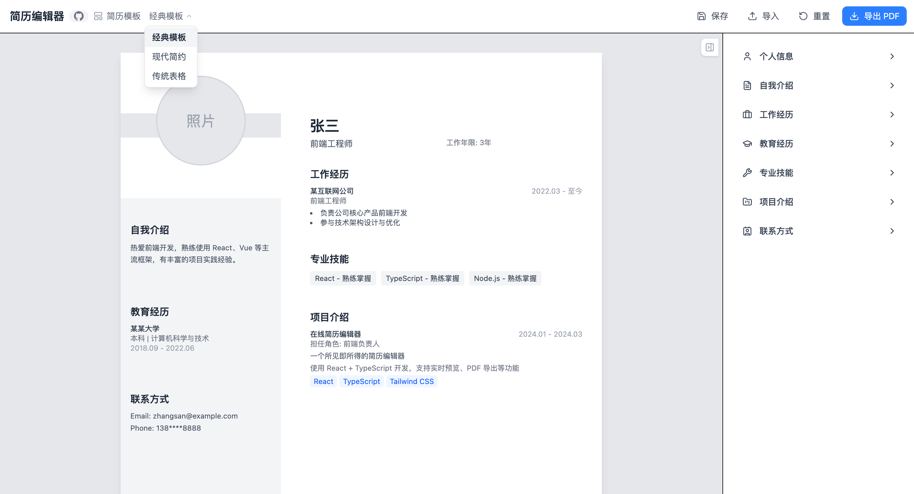

# 简历编辑器

一个简洁的在线简历编辑工具，支持实时预览、PDF 导出和数据持久化。

线上地址：[链接](https://dada-liu.github.io/resume-generator/)

效果如下：




## 功能

- **实时预览**：左侧实时显示简历效果
- **多项编辑**：支持编辑个人信息、自我介绍、工作经历、教育经历、专业技能、项目介绍、联系方式
- **PDF 导出**：点击按钮即可导出为 PDF 文件，文件名格式为 `姓名_求职岗位_年月日时分秒.pdf`
- **数据保存/导入**：支持导出 JSON 文件备份，或从 JSON 文件恢复数据

## 技术栈

- React 19 + TypeScript
- Vite
- Tailwind CSS 4
- Zustand（状态管理）
- jspdf + html-to-image（PDF 导出）
- react-hook-form + Zod（表单验证）

## 启动

```bash
npm install
npm run dev
```

打开 http://localhost:5173

## 构建

```bash
npm run build
```

## 使用

1. 在右侧编辑各项内容
2. 点击「保存」导出 JSON 备份
3. 点击「导入」从 JSON 文件恢复
4. 点击「导出 PDF」生成简历 PDF


## 竞品分析

1. WPS 有简历模板 --- 收费，简历模板丰富，适合普通人写简历
2. 木及简历 --- 大部分免费，markdown 转 pdf，适合程序员


## 商业化

1. 小红书、抖音推广
2. 店铺卖 产品码
3. 用户打开网址，输入 产品码 
4. 多套模版可选；（将 简历模板图片 -> html 应用 提炼成 skill，批量生成）

有设计感的简历：https://itunes.apple.com/cn/app/id741292507?l=en&mt=8